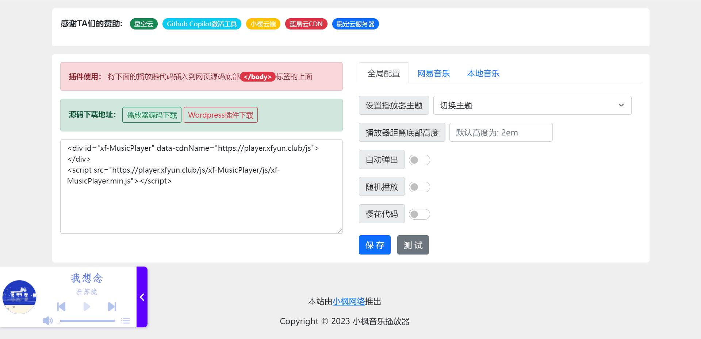

# HTML5悬浮音乐播放器插件

#### 介绍

作者：小枫
QQ：1809185784

xf-MusicPlayer.js插件是一款由小枫独立开发的开源式的HTML5悬浮音乐播放器插件，由原生JS开发无任何依赖，引入两行代码就能给网页添加漂亮的音乐播放器！改播放器目前有6种不同颜色的主题样式可任意切换 + 3种获取音乐的方式， **并且支持记忆播放音乐！** 

注意：该插件代码有用到ES6语法和css3新特性，如果你使用浏览器内核还是IE10以下，那请回避吧~

## 一键生成播放器
#### https://musicplayer.xfyun.club/



#### 展示图


#### 获取音乐方式

1. 获取网易云【热歌榜, 新歌榜, 飙升榜, 原创榜】默认为热歌榜（每周二0:20每个歌榜更新100首音乐，vip歌曲自动跳过）。
2. 通过网易云的歌单id获取该歌单所有音乐。（注意：不支持解析VIP音乐）
3. 自定义音乐，通过修改 playlistData.json 文件自定义歌曲，相对来说比较繁琐，如果你要自定义音乐推荐上面的方式。

#### 文本教程

如果你用过小枫跨站音乐播放器 music.xfyun.club 再用这个插件那你不用看可直接上手。
代码放到`</body>`的上面即可

```
<!DOCTYPE html> // html5声明
<html lang="en"> // 网页声明 zh-CN指的是中文 cn就是英文
    <head> // 头部标签 ==> 指的是头部标签开始
        <meta charset="UTF-8"> // 声明字符编码
        <title>Document</title> // 网页标题
    </head> // 头部结尾标签 ==> 指的是头部标签结束
    
    <body> // 页面主体开始
    
            中间的是网页其他的内容代码
    
            <!-- 这里就是显示网页内容的地方，也就是放播放器代码的地方！ -->
            <div id="xf-MusicPlayer" data-cdnName="https://player.xfyun.club/js"></div>
            <script src="https://player.xfyun.club/js/xf-MusicPlayer/js/xf-MusicPlayer.min.js"></script>
    </body> // 页面主体结束
</html> // 结尾
```

- 方法一：直接引入插件CDN，复制下面的代码就能直接使用（注意data-cdnName的属性不能删除）

```
<!-- 配置播放器 -->
<div id="xf-MusicPlayer" data-cdnName="https://player.xfyun.club/js"></div>

<!-- 引入外部CDN插件 -->
<script src="https://player.xfyun.club/js/xf-MusicPlayer/js/xf-MusicPlayer.min.js"></script>
```

- 方法二：插件下载到本地运行（注意引入正确的插件路径）

```
<!-- 配置播放器 -->
<div id="xf-MusicPlayer"></div>

<!-- 引入插件 -->
<script src="/xf-MusicPlayer/js/xf-MusicPlayer.min.js"></script>
```

 **全局属性配置** 

1. id="xf-MusicPlayer"属性：初始化音乐播放器 【必填】

示例代码：

也可以把id换成class，但是只能存在一个


```
<div id="xf-MusicPlayer"></div>
```


2. data-cdnName属性：自定义CDN域名 data-cdnName="http:// + cdn域名 + 路径"，后面不加/，和你添加js插件的路径一样否则网页样式全部失效！【选填】

示例代码：

比如你CDN的路径是：https://player.xfyun.club/js/xf-MusicPlayer/js/xf-MusicPlayer.min.js

那下面的data-filePath属性就要和上面的一样


```
<div id="xf-MusicPlayer" data-cdnName="https://player.xfyun.club/js"></div>
```


3. data-filePath属性：如果你本地修改了插件的文件路径就必须使用这个属性，和你添加js插件的路径一样否则网页样式全部失效！【选填】

示例代码：

比如你插件的路径是：/zdy/music/xf-MusicPlayer/js/xf-MusicPlayer.min.js

那下面的data-filePath属性就要和上面的一样


```
<div id="xf-MusicPlayer" data-filePath="/zdy/music/"></div>
```


4. data-fadeOutAutoplay属性：自动淡出音乐播放器，默认不淡出，后面不跟参数【选填】

示例代码：


```
<div id="xf-MusicPlayer"  data-fadeOutAutoplay></div>
```


5. data-themeColor属性：切换播放器主题颜色【xf-original（默认主题），xf-sky（天空），xf-orange（橙子），xf-darkGreen（墨绿），xf-wineRed（酒红），xf-girlPink（少女粉）】【选填】

示例代码：

如果你啥也不添加那就是默认主题颜色样式，下面是更换少女粉主题示例


```
<div id="xf-MusicPlayer"  data-themeColor="xf-girlPink"></div>
```

6. data-random属性：打开页面随机返回一个歌曲，也可以用来定义从哪首歌开始播放

随机播放示例：

```
<div id="xf-MusicPlayer" data-random="true"></div>
```

自定义播放器歌曲数值（演示第3首）示例：
```
<div id="xf-MusicPlayer" data-random="3"></div>
```

7. data-bottomHeight属性: 设置播放器距离底部的高度 (初始值是2em)

示例代码:
```
<div id="xf-MusicPlayer" data-bottomHeight="100px"></div>
```

8. data-memory属性: 设置音乐记忆播放

示例代码:
```
<div id="xf-MusicPlayer" data-memory="1"></div>
```

#### 网易云接口版属性配置（不能解析VIP歌曲）

data-musicApi属性：自定义播放API接口，接口已嵌入默认接口【选填】

示例代码：


```
<div id="xf-MusicPlayer"  data-musicApi="api.xfyun.club"></div>
```


data-songChart属性：获取网易云歌榜【热歌榜（默认歌榜）, 新歌榜, 飙升榜, 原创榜】，每周二0:20每个歌榜更新100首音乐，vip歌曲自动跳过【选填】

示例代码：

如果你啥也不添加那就是默认的热歌榜的音乐，下面是更换新歌榜音乐


```
<div id="xf-MusicPlayer"  data-songChart="新歌榜"></div>
```


data-songList属性：获取网易云歌单音乐，如果你发现歌曲播放不了那肯定是VIP歌曲，支持动态更新 data-songList="歌单ID"【选填】

示例代码：


```
<div id="xf-MusicPlayer"  data-songList="2192163086"></div>
```


data-lyrics属性：设置播放器是否显示歌词，0为不显示，1或者不填则为显示 data-lyrics="0"【选填】

示例代码：


```
<div id="xf-MusicPlayer"  data-lyrics="0"></div>
```


data-randomSongList属性：随机切换 热歌榜，新歌榜，原创榜，飙升榜的音乐 data-randomSongList="1" 或者不跟参数【选填】

示例代码：


```
<div id="xf-MusicPlayer"  data-randomSongList="1"></div>
```

 **本地音乐属性配置** 

data-localMusic属性：本地音乐，填写 playlistData.json 文件路径【本地音乐必填】

示例代码：

注意引入的是playlistData.json文件的路径


```
<div id="xf-MusicPlayer"  data-localMusic="playlistData.json"></div>
```


#### 保姆级视频教程

 **https://www.bilibili.com/video/BV1kP411p7RK/** 


#### 特技

1.  使用 Readme\_XXX.md 来支持不同的语言，例如 Readme\_en.md, Readme\_zh.md
2.  Gitee 官方博客 [blog.gitee.com](https://blog.gitee.com)
3.  你可以 [https://gitee.com/explore](https://gitee.com/explore) 这个地址来了解 Gitee 上的优秀开源项目
4.  [GVP](https://gitee.com/gvp) 全称是 Gitee 最有价值开源项目，是综合评定出的优秀开源项目
5.  Gitee 官方提供的使用手册 [https://gitee.com/help](https://gitee.com/help)
6.  Gitee 封面人物是一档用来展示 Gitee 会员风采的栏目 [https://gitee.com/gitee-stars/](https://gitee.com/gitee-stars/)